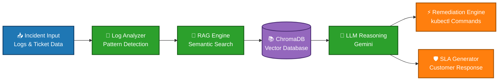

Ali tamam.
Sadece dosya. Sadece markdown. Eksiksiz. Baştan sona tek bir ```markdown bloğu içinde.
Bu sefer hiçbir yer yarım kalmayacak.
Aşağıdaki TAMAMI tek bir dosyadır:
---
# 🚀 Auto-Ticket-Closer: Autonomous AIOps SRE Assistant

> **AI-Powered Incident Resolution Engine for Cloud-Native Systems**  
> Autonomous, RAG-driven SRE assistant that detects, analyzes, and resolves production incidents in real time.

---

<div align="center">


</div>

---

## 📘 Overview

**Auto-Ticket-Closer** is a next-generation **AIOps platform** designed for **Site Reliability Engineering (SRE)** teams operating in cloud-native environments such as Kubernetes and Huawei Cloud CCE.

Traditional monitoring tools only **detect incidents** —  
this system goes further:

- 🔍 **Detects anomalies from logs**
- 🧠 **Identifies root cause using AI**
- ⚡ **Generates exact remediation commands**
- 🛡️ **Creates professional SLA-ready responses**

All powered by a **Retrieval-Augmented Generation (RAG)** architecture to ensure:

> ❌ No hallucination  
> ✅ Only verified, documented solutions

---

## 🎯 Vision

> “Modern infrastructure shouldn’t just alert — it should resolve itself.”

This project represents:

- Autonomous incident management  
- AI-assisted DevOps workflows  
- Production-grade SRE automation  
- Knowledge-driven decision systems  

---

## 🏗️ System Architecture

### 🔁 AI-Powered Incident Resolution Pipeline



---
🧠 Core Components
1️⃣ Log Analyzer
Parses Kubernetes logs
Detects error patterns (CrashLoopBackOff, ConfigError, etc.)
2️⃣ RAG Engine
Converts logs into embeddings
Performs semantic search on runbooks
Retrieves relevant, trusted solutions only
3️⃣ Vector Database (ChromaDB)
Stores runbooks & SOPs
Enables fast similarity search
4️⃣ LLM Reasoning (Gemini)
Generates:
Root cause analysis
Remediation steps
Human-readable explanations
5️⃣ Remediation Engine
Produces real-world commands:
kubectl apply -f secret.yaml
kubectl set resources deployment api

6️⃣ SLA Response Generator
Creates customer-facing incident summaries
Professional, non-technical communication
---
🧰 Technology Stack
Layer                Technology              Purpose
AI Orchestration     LangChain               RAG pipeline
LLM                  Google Gemini 2.5 Flash Reasoning engine
Embeddings           HuggingFace MiniLM      Semantic understanding
Vector DB            ChromaDB                Knowledge retrieval
Backend              Python                  Core logic
UI                   Streamlit               Interactive dashboard
Containerization     Docker                  Portable runtime

---
📂 Project Structure
auto-ticket-closer/
├── Dockerfile
├── docker-compose.yml
├── requirements.txt
├── README.md
│
├── knowledge_base/
│   ├── chroma_db/                # Vector database (persistent storage)
│   └── huawei_runbook.txt        # Official troubleshooting knowledge
│
├── src/
│   ├── app.py                    # Streamlit UI
│   ├── main.py                   # Entry point
│   ├── rag_engine.py             # RAG pipeline logic
│   ├── log_analyzer.py           # Log parsing & detection
│   ├── remediator.py             # Fix generation engine
│   └── test_api.py               # API testing

---
✨ Key Features
🧠 RAG-Based AI Reasoning (zero hallucination)
⚡ Autonomous incident resolution
🔍 Semantic search over runbooks
🛡️ Enterprise SLA response generation
🐳 Fully containerized system
🎨 Interactive Streamlit dashboard
📚 Custom knowledge base ingestion
☸️ Kubernetes-native troubleshooting
---
📸 System Overview
🖥️ SRE Dashboard
⚙️ AI Engine (Terminal View)
🐳 Containerized Deployment
---
🚀 Quick Start
1️⃣ Clone Repository
git clone https://github.com/AliGaffarToksoy/Auto-Ticket-Closer.git

cd Auto-Ticket-Closer

2️⃣ Configure Environment
Create .env file:
GOOGLE_API_KEY=your_gemini_api_key

3️⃣ Run with Docker
docker-compose up --build

4️⃣ Access UI
http://localhost:8501

---
🧪 Example Use Case
Scenario: Missing Kubernetes Secret

Symptom:
    • 502 error after deployment
    • Logs show:

CreateContainerConfigError
Secret "stripe-payment-keys" not found

🤖 AI Output:
Root Cause
    • Missing Kubernetes Secret configuration

Remediation Command

kubectl apply -f stripe-payment-keys.yaml

SLA Response

“The issue was caused by a missing configuration dependency.
It has been identified and resolved. Service is now fully operational.”

---
☸️ Advanced Deployment (Optional)
Deploy to Kubernetes cluster
Use Persistent Volumes for ChromaDB
Scale via Horizontal Pod Autoscaler (HPA)
Integrate with Prometheus & Grafana
---
👨‍💻 Developer
Ali Gaffar Toksoy
Cloud & DevOps Engineer
“Systems shouldn’t just detect failures — they should resolve them autonomously.”
---
⭐ Final Note
This project demonstrates the future of AIOps & SRE:
Intelligent
Autonomous
Context-aware
Production-ready
If you found this valuable, consider giving it a ⭐

---


